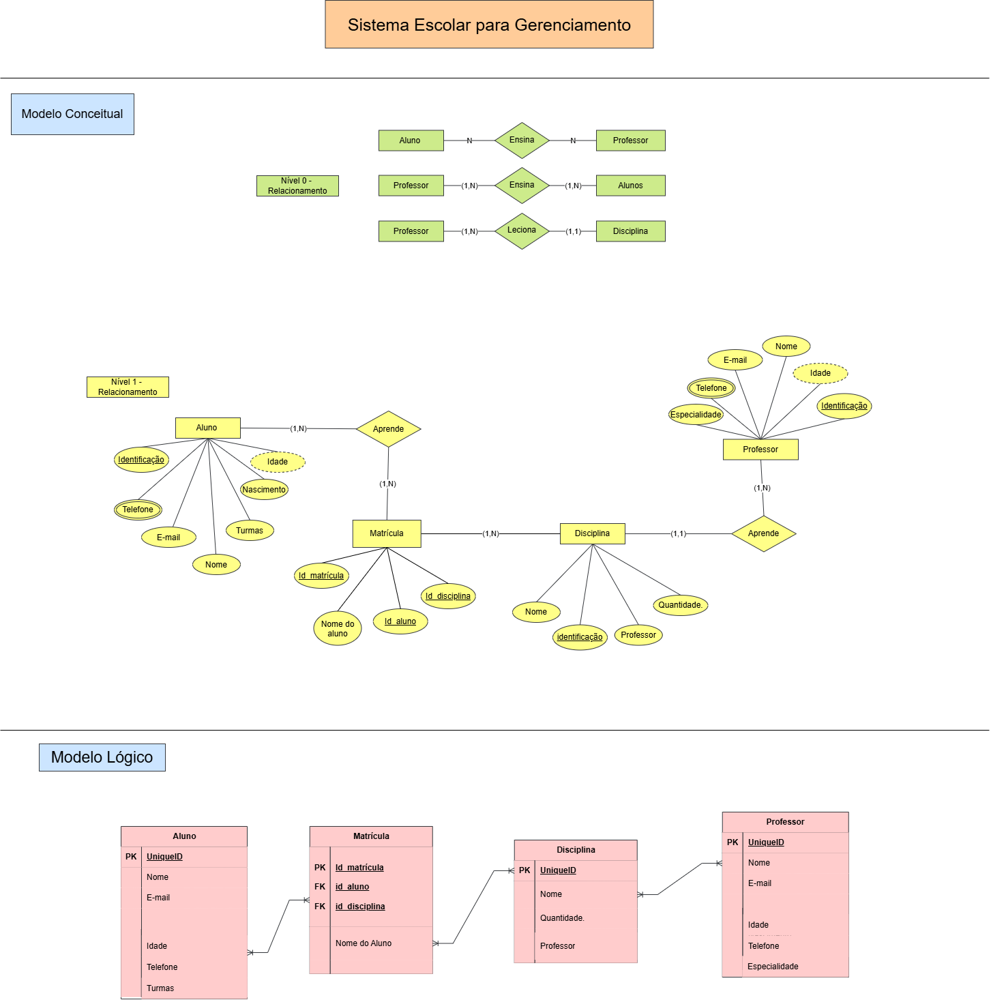
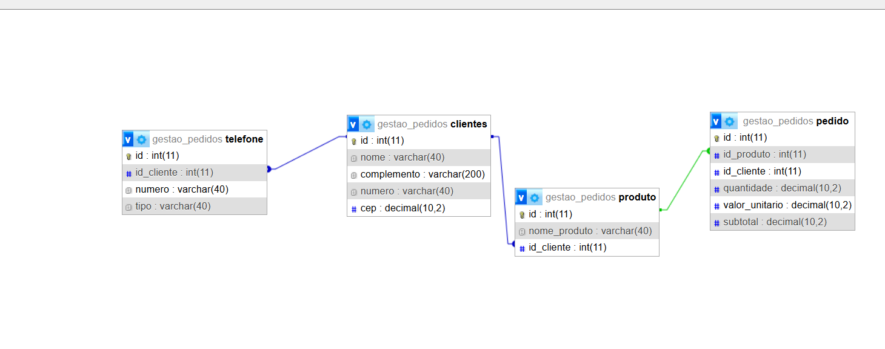

# Atividade Mer e Der

## Projeto: Gestão de escola (Alunos, Matrículas e Professores)



## Código "Dicionário de Dados"

|Entidade|Atributo|Tipo|Tamanho|Descrição
|-|-|-|-|-|
|Alunos|`id`|`int`|`11`|Chave Primária|
|Alunos|`Nome`|`varchar`|`40`|nome do aluno|
|Alunos|`Idade`|`int`|`5`|idade do aluno|
|Alunos|`Nascimento`|`int`|`20`|data de nascimento do aluno|
|Alunos|`Turma`|`varchar`|`1`|letra da turma do aluno|
|Alunos|`Telefone`|`int`|`10`|numero de telefone do aluno|
|Disciplina|`id`|`int`|`11`|Chave Primária|
|Disciplina|`Nome`|`varchar`|`11`|nome da disciplina|
|Disciplina|`Quantidade`|`varchar`|`14`|numero de aulas por turma|
|Disciplina|`Professor`|`varchar`|`13`|nome do professor que ensina|
|Professor|`id`|`int`|`11`|Chave Primária|
|Professor|`Nome`|`varchar`|`13`|nome do professor que ensina|
|Professor|`Idade`|`int`|`5`|idade do professor|
|Professor|`Nascimento`|`varchar`|`13`|data de nascimento do professor|
|Professor|`Telefone`|`varchar`|`13`|telefone do professor|
|Professor|`Especialidade`|`varchar`|`16`|Matéria que o professor ensina|
|Matrícula|`id_aluno`|`int`|`16`|Chave Primária|
|Matrícula|`id_matrícula`|`int`|`16`|Chave Primária|
|Matrícula|`id_disciplina`|`int`|`16`|Chave Primária|
|Matrícula|`Nome do Aluno`|`varchar`|`16`|Nome do Aluno|

# Tabelas em CSV

* [Aluno.CSV](./Aluno.CSV)

* [Disciplina.CSV](./Disciplina.CSV)

* [Matrícula.CSV](./Matrícula.CSV)

* [Professor.CSV](./professor.CSV)

## Atividade ddl.sql

# Gestão de Pedidos (Professor)

# Código
```
create database gestao_pedidos;
-- Acessa o Banco de dados
use gestao_pedidos;
-- Criar a tabela de Produtos
create table clientes(
    id int primary key not null auto_increment,
    nome varchar(40) not null,
    complemento varchar(200),
    numero varchar(40) not null,
    cep decimal(10,2) not null
);
-- Criar a tabela de Fornecedor
create table telefone(
    id int primary key not null auto_increment,
    id_cliente int not null,
    numero varchar(40) not null,
    tipo varchar(40) not null
);
-- Criar tabela de Compra
create table produto(
    id int primary key not null auto_increment,
    nome_produto varchar(40) not null
    id_cliente int not null
);
create table pedido(
    id int primary key not null auto_increment,
    id_produto int not null,
    id_cliente int not null,
    quantidade decimal(10,2),
    valor_unitario decimal(10,2) not null,
    subtotal decimal(10,2) not null
);
-- Criar as chaves estrangeiras (Relacionamentos)
alter table telefone add constraint possui foreign key (id_cliente) references clientes(id);
alter table pedido add constraint fornece foreign key (id_produto) references produto(id);
alter table produto add constraint fornece foreign key (id_cliente) references clientes(id);

-- Vendo as tabelas criadas
show tables;
describe clientes;
describe telefone;
describe produto;
describe pedido;
```
# MySQL



## Código do meu desafio (Gestão de Escola)

# Código

```
drop database if exists gestao_escola;

create database gestao_escola;
-- Acessa o Banco de dados
use gestao_escola;
-- Criar a tabela de Produtos
create table aluno(
    id int primary key not null auto_increment,
    nome varchar(40) not null,
    idade varchar(20) not null,
    telefone varchar(40) not null,
    nascimento varchar(40) not null,
    email varchar(40) not null,
    turma varchar(40) not null
);
-- Criar a tabela de Fornecedor
create table disciplina(
    id int primary key not null auto_increment,
    professor varchar(40) not null,
    nome_disciplina varchar(40) not null,
    quantidade decimal(10,2) not null
);
-- Criar tabela de Compra
create table matricula(
    id int primary key not null auto_increment,
    nome_aluno varchar(40) not null,
    id_aluno int not null,
    id_matricula int not null,
    id_disciplina not null
);
create table professor(
    id int primary key not null auto_increment,
    nome varchar(40) not null,
    idade varchar(40) not null,
    nascimento varchar(40) not null,
    telefone varchar(40) not null,
    especialidade varchar(40) not null
);
-- Criar as chaves estrangeiras (Relacionamentos)
alter table matricula add constraint possui foreign key (id_aluno) references aluno(id);
alter table matricula add constraint possui foreign key (id_matricula) references matricula(id);
alter table matricula add constraint possui foreign key (id_disciplina) references discicplina(id);
-- Vendo as tabelas criadas
show tables;
describe aluno;
describe disciplina;
describe matricula;
describe professor;
```

# MySQL


